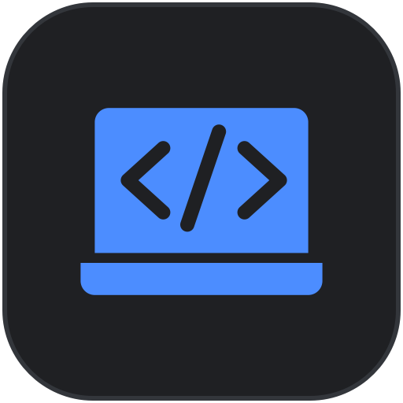

# KnowYourCode

Clin d'œil au KYC bancaire : connaître son code plutôt que son client.

Un utilitaire de barre de menus pour macOS. Quand vous avez un moment, vous
ouvrez son panneau : il tire au hasard une fonction du projet sur lequel vous
travaillez avec Claude Code, et vous demande de l'expliquer. Un modèle tiers
compare votre explication au code et vous dit ce que vous avez oublié.

Le but n'est pas de noter, c'est de garder la maîtrise d'un code qu'on ne
relit plus, et de s'entraîner au passage sur Python et TypeScript.

Rien ne s'ouvre tout seul, jamais. C'est vous qui décidez du moment.

## Installation

macOS, Python 3.10 ou plus récent.

```bash
python3 -m venv .venv
source .venv/bin/activate
pip install -r requirements.txt
```

L'évaluation passe par l'API Mistral. Deux façons de fournir la clé, au choix :

```bash
export MISTRAL_API_KEY="votre-clé"
# ou, pour ne pas dépendre de l'environnement du terminal :
mkdir -p ~/.knowyourcode
echo "votre-clé" > ~/.knowyourcode/cle_mistral && chmod 600 ~/.knowyourcode/cle_mistral
```

Sans clé, l'application démarre quand même et rend une évaluation factice :
tout le reste fonctionne, il n'y a que le verdict qui est faux.

## Lancement

Depuis un terminal :

```bash
python -m connais_ton_code
```

Ou en application à double-cliquer :

```bash
python outils/creer_app.py
open KnowYourCode.app
```

Le paquet ainsi fabriqué contient le chemin de ce dépôt : il n'est pas
transportable d'une machine à l'autre, mais il se refait en une commande. Vous
pouvez le glisser dans le dossier Applications ou le mettre au démarrage.

## Fabriquer le DMG

Deux paquets, deux usages. `creer_app.py` produit un paquet jetable qui pointe
vers ce dépôt : fabriqué en une seconde, bon pour cette machine seulement.
`creer_dmg.py` gèle Python, Qt et le code à l'intérieur du paquet, le signe et
l'enferme dans une image disque : plus lent, mais c'est celui qui se donne.

```bash
python outils/creer_dmg.py
```

L'image atterrit dans `dist/`, nommée `KnowYourCode-<version>-<arch>.dmg`, la
version étant lue dans `pyproject.toml` et nulle part ailleurs. Elle contient
l'application et le raccourci vers Applications, comme tout le monde s'y
attend.

Sans certificat « Developer ID Application » dans le trousseau, le script
signe le paquet ad hoc et le dit clairement : l'image se monte et
l'application démarre ici, mais macOS la refusera partout ailleurs. S'il
trouve un certificat, il l'utilise et signe avec runtime durci ;
`--notariser` ajoute la soumission à Apple et l'agrafage du ticket.

Poser un tag `v*` déclenche `.github/workflows/publication.yml`, qui refait
tout cela sur un runner macOS et attache le DMG à une Release. Obtenir le
certificat, créer la clé d'API et poser les secrets GitHub :
[outils/PUBLIER.md](outils/PUBLIER.md).

## Le rappel dans Claude Code

Plutôt qu'une notification, qui suppose une autorisation du système et
disparaît en trois secondes, le rappel se glisse là où le regard se pose déjà :
le compteur d'attente de Claude Code.

L'interrupteur des réglages écrit un bloc `spinnerVerbs` dans
`~/.claude/settings.json`. Pendant que Claude travaille, le terminal affiche
`<kyc>🧠 Révise pendant que je travaille</kyc>`, et une douzaine d'autres.
L'éteindre retire le bloc et rend à Claude Code ses propres verbes. Dans les
deux sens, le reste du fichier est conservé, et il faut redémarrer Claude Code
pour voir le changement.

La même chose en ligne de commande :

```bash
python outils/phrases_attente.py            # pose le rappel
python outils/phrases_attente.py --retirer  # le retire
```

**Pour écrire vos propres phrases**, posez un tableau JSON dans
`~/.knowyourcode/phrases.json` :

```json
["Relis avant de valider", "Tu saurais réécrire ça sans moi ?"]
```

Elles s'écrivent nues : la balise `<kyc>` est ajoutée à la pose, et toute
phrase dépassant soixante caractères une fois habillée est écartée, Claude
Code la couperait au milieu d'un mot.

## Deux surfaces

L'application n'apparaît pas dans le Dock, et rien ne s'ouvre au lancement :
elle pose son icône dans la barre de menus et attend.

**Le panneau**, sous l'icône, ne contient que l'exercice : le code, la zone de
réponse, le verdict. On y répond en trente secondes et on retourne travailler.

**La grande fenêtre**, au centre de l'écran, porte ce qu'on consulte en
s'arrêtant : la progression et les réglages. Elle s'ouvre par l'icône en bas à
gauche du panneau, et se ferme d'un Esc. Elle ne touche pas au cycle de
l'exercice : on peut la consulter pendant qu'une question attend sa réponse.

## Vérification

```bash
python verifier.py
```

Le script contrôle d'abord le repérage des fonctions et le calcul des
statistiques, sur des historiques construits à la main plutôt que rejoués
depuis un fichier, puis déroule un cycle complet dans l'interface : ouverture,
question, réponse, évaluation, retour, ouverture de la grande fenêtre,
passage, fermeture. Il ouvre le panneau à l'écran pendant quelques secondes,
et rend un code de sortie non nul en cas d'échec. Il n'a besoin ni de réseau,
ni de clé, ni d'une session Claude Code en cours.

## Le cycle

1. **Fermé** — l'état par défaut, seule l'icône est visible.
2. **Repos** — le panneau est ouvert, rien n'est demandé. Un bouton permet de
   réclamer une question.
3. **Question** — le chemin du fichier, le nom de la fonction, le code coloré,
   une zone de saisie, les boutons Répondre (Cmd+Entrée) et Passer.
4. **Évaluation** — un indicateur d'attente ; le panneau reste utilisable.
5. **Retour** — le verdict, ce qui a été oublié, et un bouton Suivant.

La progression et les réglages ne figurent pas dans ce cycle : ils vivent dans
la grande fenêtre, qui s'ouvre et se ferme sans rien changer à l'exercice en
cours.

La progression montre, dans cet ordre : quatre chiffres clés (score moyen avec
sa tendance, jours d'affilée, réponses données, fonctions vues), un calendrier
des douze dernières semaines, la courbe des vingt derniers scores, la
répartition des notes par tranche, le détail par langage, ce qui revient le
plus souvent dans les oublis, et les fonctions les moins bien expliquées. Tant
qu'aucune réponse n'a été donnée, elle dit juste qu'il n'y a encore rien à
montrer, plutôt que d'afficher des zéros qui ne diraient rien.

Le choix des formes suit le travail de chaque donnée : un chiffre qui résume
se pose en grand plutôt qu'en graphique, une régularité se lit en calendrier
parce que ce sont les trous qui parlent, une répartition se lit en barres
parce qu'on y compare des longueurs. Les couleurs suivent la même règle : une
teinte unique pour une série unique, une seule teinte du vide au plein pour
une intensité, des teintes distinctes pour des catégories. Ces dernières sont
passées à un validateur de palette plutôt que choisies à l'œil, pour rester
séparables en vision déficiente.

Les transitions autorisées sont déclarées dans `etats.py` et vérifiées à
chaque passage : une transition hors table est traitée comme un bug, pas comme
un cas à absorber en silence.

## Comment ça marche

**Le projet en cours** (`projet.py`) se lit dans les transcripts JSONL de
Claude Code, sous `~/.claude/projects/`. Le transcript modifié en dernier
désigne la session la plus récente, et son champ `cwd` donne le dossier de
travail. Ce champ plutôt que le nom du dossier parent, qui encode le chemin en
remplaçant les barres par des tirets et n'est donc pas réversible dès qu'un
nom contient lui-même un tiret.

**La sélection** (`selecteur.py`, `extraction.py`) parcourt ce projet et tire
une fonction au hasard parmi celles de 4 à 60 lignes. Les fonctions Python
sont repérées avec `ast`, les fonctions TypeScript et TSX par un comptage
d'accolades qui saute les chaînes et les commentaires. Au hasard, et non « la
plus récente » : le code qu'on ne comprend plus n'est pas toujours celui qu'on
vient d'écrire.

**L'évaluation** (`evaluateur.py`) envoie le code et votre explication à
`mistral-small-latest` et en attend un verdict, une note et une liste de ce
que vous n'avez pas mentionné. Un modèle tiers plutôt que celui qui a écrit le
code : on ne demande pas à quelqu'un de corriger la copie qu'il a dictée.
L'appel a lieu hors du fil de l'interface, qui reste utilisable pendant ce
temps.

Chacune de ces briques est un `Protocol` doublé d'une version factice,
utilisée par la vérification et comme repli quand la vraie n'est pas
disponible.

## Données locales

Tout reste sur la machine, en clair, dans `~/.knowyourcode/` :

- `historique.json` — les questions posées, la réponse donnée, l'évaluation et
  la date. Sert à ne pas reposer deux fois la même question, et à mesurer la
  progression.
- `cle_mistral` — la clé d'API, si vous choisissez cette méthode. Hors du
  dépôt, exprès.

La variable d'environnement `KNOWYOURCODE_DOSSIER` déplace ce dossier, ce dont
se sert `verifier.py` pour ne pas polluer l'historique réel.

## Notes macOS

- **L'apparence.** Les composants viennent de PyQt6-Fluent-Widgets, mais le
  cadre est dessiné à la main : panneau sombre sans bordure de titre, coins
  arrondis, police d'interface du système. Le rendu Fluent d'origine, avec sa
  barre de titre et sa police Segoe UI, jure franchement à côté d'un terminal
  macOS. Aucun composant de la version Pro n'est utilisé.
- **Le logo et l'icône** sont décrits en tracés dans `logo.py`, jamais chargés
  depuis un fichier image. Le même dessin sert au logo en couleur, à l'icône
  monochrome de la barre, à celle de l'entête du panneau et au `.icns` de
  l'application. L'icône de la barre est déclarée comme masque : macOS la
  recolore selon le thème, comme les siennes.
- **Le paquet.** `outils/creer_app.py` copie dans le paquet le véritable
  exécutable Python, et non le relais `bin/python3` qui ré-exécuterait
  `Python.app` et rendrait à macOS l'identité de Python. La copie est
  re-signée localement, sans quoi le système l'abat au démarrage. Cet
  interpréteur est l'exécutable du paquet, sans script intermédiaire : un
  lanceur qui `exec`ait un autre programme faisait perdre au système la trace
  de l'application, et son icône de barre de menus n'était jamais placée.
  Comme aucun argument n'est passé à l'exécutable, c'est `LSEnvironment` qui
  pointe vers un `sitecustomize.py`, importé d'office par Python, et qui
  démarre l'application.
- **Le paquet distribuable.** `outils/creer_dmg.py` obtient la même identité
  autrement : le binaire d'amorçage de PyInstaller est un vrai programme, il
  n'y a donc pas non plus de relais en cours de route. La notarisation impose
  le runtime durci, qui interdit par défaut ce dont Python et Qt vivent :
  compiler du code à la volée et charger des bibliothèques signées par
  quelqu'un d'autre qu'Apple. `outils/droits.plist` lève ces deux
  interdictions, et seulement celles-là.
- **Les certificats.** Les Python installés depuis python.org n'ont pas de
  magasin de certificats tant qu'on n'a pas lancé leur script d'installation.
  L'appel à Mistral passe donc par `certifi`.

## Licence

MIT, voir [LICENSE](LICENSE).
